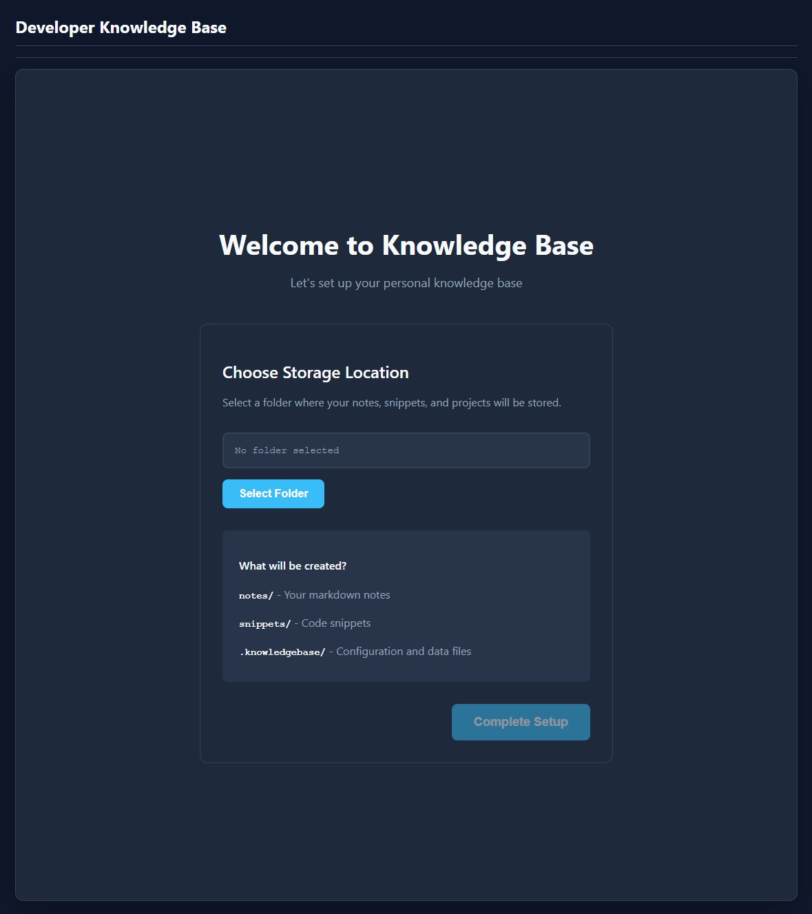
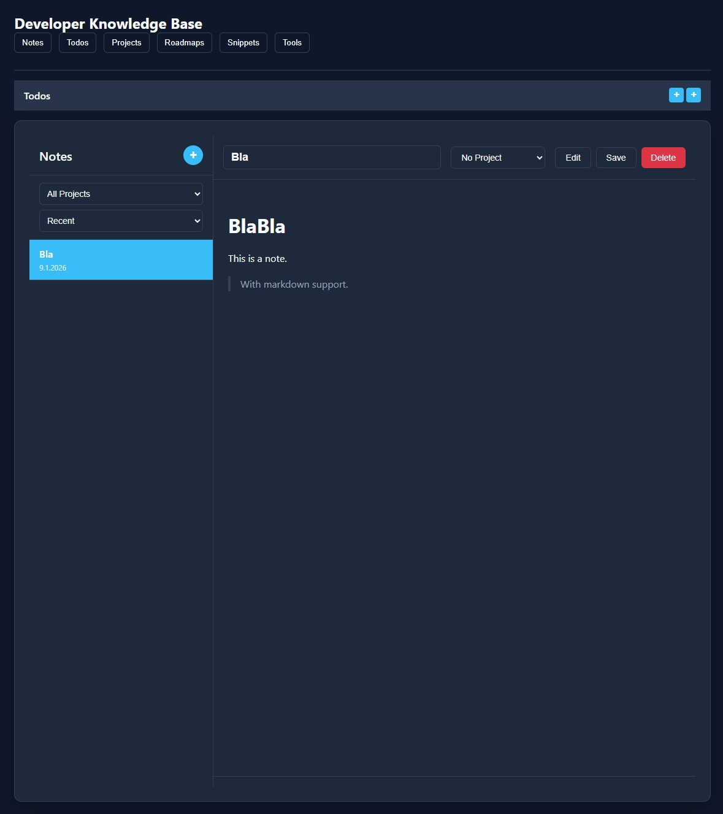

# Athena Notes




A modern, cross-platform developer knowledge base and productivity suite. Organize notes, code snippets, todos, projects, and tools—all in one beautiful desktop app.

---

## ✨ Features

- **Notes**: Markdown editor with live preview, project organization, and internal linking.
- **Code Snippets**: Save, search, and tag code snippets by language, usage, and module. Syntax highlighting included.
- **Todos**: Persistent, prioritized todo panel with deadlines and project association.
- **Daily Todos**: Overview of tasks for the current day. Short and simple.
- **Projects**: Group notes, todos, and roadmaps by initiative. Edit, rename, and manage projects easily.
- **Tools Launcher**: Quick-launch for your favorite apps and URLs, categorized for easy access.
- **Roadmaps & Milestones**: Plan and track progress with visual timelines.
- **Beautiful UI**: Responsive interface with modern design and smooth interactions.
- **Electron + Vite**: Fast startup, hot reload, and native desktop experience.

---

## 🚀 Getting Started

### Prerequisites
- [Node.js](https://nodejs.org/) (v18+ recommended)
- [npm](https://www.npmjs.com/)

### Installation
```bash
# Clone the repository
$ git clone https://github.com/fbirk/AthenaNotes.git
$ cd AthenaNotes

# Install dependencies
$ npm install
```

### Running the App
```bash
# Start the development server
$ npm run dev

# The app will open in Electron and Vite will serve the renderer at http://localhost:5173/
```

---

## 🛠️ Usage

- **Storage**: Upon startup, select the folder on your local file system to store all application data (notes, todos, etc.)
- **Create Notes**: Click the + button in Notes. Write in Markdown, link to other notes, and assign to projects.
- **Add Snippets**: Go to Snippets, click + New Snippet, fill in details (usage/module/language optional).
- **Track Todos**: Open the Todos panel, add tasks, set priorities and deadlines.
- **Manage Projects**: Create, edit, and delete projects. Group notes and todos by project.
- **Launch Tools**: Add your favorite apps/URLs in Tools. Launch with one click.

### Keyboard Shortcuts

| Shortcut | Action |
|----------|--------|
| `Ctrl+T` | Toggle the pinned todos panel (not available on Todos page) |
| `Ctrl+N` | Create a new note (navigates to Notes if on another page) |
| `Ctrl+S` | Save the current note |
| `Ctrl+F` | Focus the search input (notes or snippets) |
| `Escape` | Close any open modal dialog |

---

## 👩‍💻 Developer Guide

- **Source Structure**:
  - `src/main/` — Electron main process, IPC, file services
  - `src/renderer/` — UI components, styles, and logic
  - `src/shared/` — Validators and shared constants
  - `specs/` — Documentation, plans, and contracts for spec driven development
- **Hot Reload**: Changes in renderer auto-refresh the UI.
- **IPC API**: Extend backend features via `window.knowledgeBase.invoke()`.
- **Styling**: Customize themes in `src/renderer/styles/`.

> For the dev environment, you can copy the `.dev-storage.sample.json` into a `.dev-storage.json` file in the project root. When running `npm run dev` the location in this config will be used and you don't have to select the location on each startup.

### Technologies

* [electron](https://www.electronjs.org/de/) - cross-platform desktop application from nodejs app
* [vite](https://vite.dev/) - as a build tool
* [spec-kit](https://github.com/github/spec-kit) - ai assisted spec-driven development scripts

---

## 🔄 Versioning & Releases

This project uses [Semantic Versioning](https://semver.org/) and [Conventional Commits](https://www.conventionalcommits.org/) for automated releases.

### Version Format: `MAJOR.MINOR.PATCH`

| Change Type | Version Bump | Example |
|-------------|--------------|---------|
| Breaking changes | MAJOR | 1.0.0 → 2.0.0 |
| New features | MINOR | 1.0.0 → 1.1.0 |
| Bug fixes | PATCH | 1.0.0 → 1.0.1 |

### Commit Message Format

```
<type>[optional scope]: <description>

[optional body]

[optional footer(s)]
```

### Commit Types

| Type | Description | Triggers Release? |
|------|-------------|-------------------|
| `feat:` | New feature | Yes (MINOR) |
| `fix:` | Bug fix | Yes (PATCH) |
| `perf:` | Performance improvement | Yes (PATCH) |
| `docs:` | Documentation only | No |
| `style:` | Code style (formatting, etc.) | No |
| `refactor:` | Code refactoring | No |
| `test:` | Adding/updating tests | No |
| `chore:` | Maintenance tasks | No |
| `ci:` | CI/CD changes | No |

### Breaking Changes

For breaking changes, either:
- Add `!` after the type: `feat!: redesign settings API`
- Add `BREAKING CHANGE:` in the footer

### Examples

```bash
# Patch release (1.0.0 → 1.0.1)
git commit -m "fix: resolve crash when opening empty project"

# Minor release (1.0.0 → 1.1.0)
git commit -m "feat: add dark mode toggle to settings"

# Major release (1.0.0 → 2.0.0)
git commit -m "feat!: change note storage format to JSON"

# No release triggered
git commit -m "docs: update README with new screenshots"
git commit -m "chore: update dependencies"
```

---

## 🤝 Contributing

Pull requests, issues, and feature suggestions are welcome! See [specs/master/plan.md](specs/master/plan.md) for roadmap and guidelines.

When contributing, please follow the [Conventional Commits](#commit-message-format) format for your commit messages to ensure proper versioning and changelog generation.

---

## 📄 License

MIT License. See [LICENSE](LICENSE.md) for details.

---

## 📸 Screenshots

