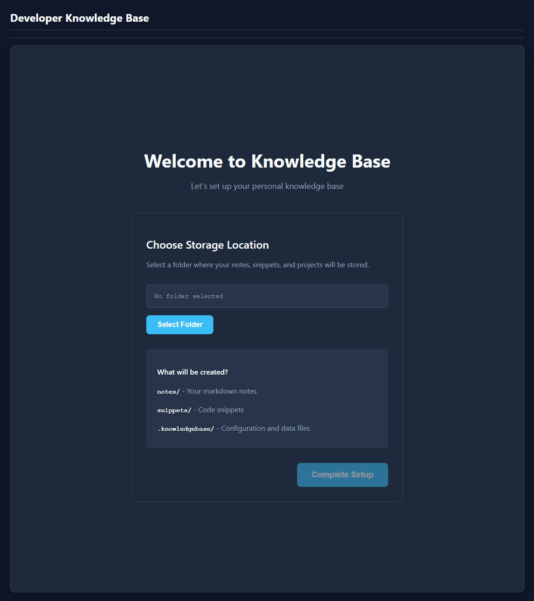
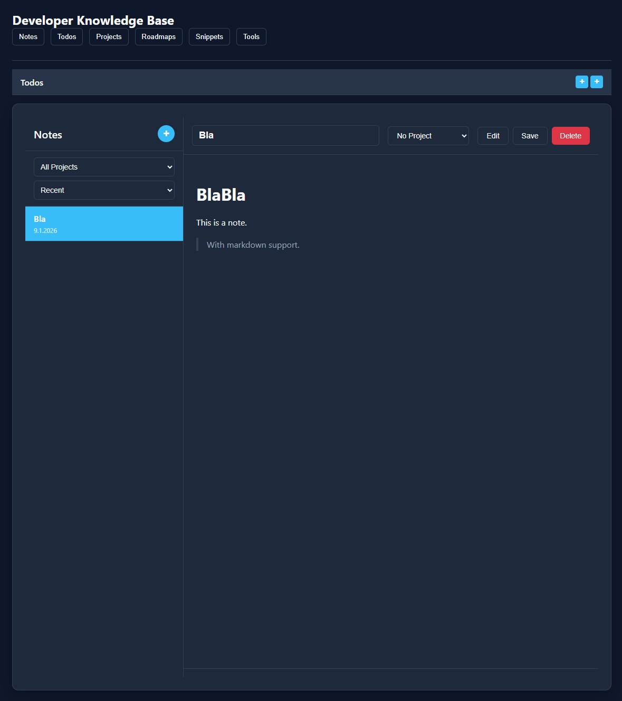

# Athena Notes




A modern, cross-platform developer knowledge base and productivity suite. Organize notes, code snippets, todos, projects, and tools — available as a desktop app **and** a terminal CLI.

---

## ✨ Features

- **Notes**: Markdown editor with live preview, project organization, and internal linking.
- **Code Snippets**: Save, search, and tag code snippets by language, usage, and module. Syntax highlighting included.
- **Todos**: Persistent, prioritized todo panel with deadlines and project association.
- **Daily Todos**: Overview of tasks for the current day. Short and simple.
- **Projects**: Group notes, todos, and roadmaps by initiative. Edit, rename, and manage projects easily.
- **Tools Launcher**: Quick-launch for your favorite apps and URLs, categorized for easy access.
- **Roadmaps & Milestones**: Plan and track progress with visual timelines.
- **Two interfaces**: Desktop GUI (Electron) and keyboard-driven Terminal CLI (Ink).
- **Shared storage**: Both interfaces read and write the same data — switch freely between them.

---

## 🚀 Getting Started

### Prerequisites
- [Node.js](https://nodejs.org/) (v18+ recommended)
- [npm](https://www.npmjs.com/)
- [PowerShell 7+](https://github.com/PowerShell/PowerShell) (for CLI version — ANSI color and Unicode support)

### Installation
```bash
# Clone the repository
$ git clone https://github.com/fbirk/AthenaNotes.git
$ cd AthenaNotes

# Install dependencies
$ npm install
```

### Running the Desktop App
```bash
# Start the development server
$ npm run dev

# The app will open in Electron and Vite will serve the renderer at http://localhost:5173/
```

### Running the CLI
```bash
# Launch the CLI (auto-detects storage from desktop app config)
$ npm run cli

# Or specify a storage folder explicitly
$ npm run cli -- --storage "C:\Users\YourName\KnowledgeBase"

# Development mode with auto-restart on file changes
$ npm run cli:dev
```

---

## 🛠️ Desktop App Usage

- **Storage**: Upon startup, select the folder on your local file system to store all application data (notes, todos, etc.)
- **Create Notes**: Click the + button in Notes. Write in Markdown, link to other notes, and assign to projects.
- **Add Snippets**: Go to Snippets, click + New Snippet, fill in details (usage/module/language optional).
- **Track Todos**: Open the Todos panel, add tasks, set priorities and deadlines.
- **Manage Projects**: Create, edit, and delete projects. Group notes and todos by project.
- **Launch Tools**: Add your favorite apps/URLs in Tools. Launch with one click.

### Desktop Keyboard Shortcuts

| Shortcut | Action |
|----------|--------|
| `Ctrl+T` | Toggle the pinned todos panel (not available on Todos page) |
| `Ctrl+N` | Create a new note (navigates to Notes if on another page) |
| `Ctrl+S` | Save the current note |
| `Ctrl+F` | Focus the search input (notes or snippets) |
| `Escape` | Close any open modal dialog |

---

## 🖥️ CLI Usage Guide

The CLI provides the full KnowledgeBase experience in your terminal. It shares the same storage as the desktop app, so you can switch between them freely.

### First Run

If you haven't used the desktop app before, the CLI will guide you through selecting a storage folder on first launch. If you've already set up the desktop app, the CLI auto-detects your storage location.

The CLI resolves your storage path in this order:
1. `--storage` CLI argument
2. `KNOWLEDGEBASE_STORAGE` environment variable
3. Desktop app config (`.dev-storage.json`)
4. CLI config (`~/.knowledgebase-cli.json`)
5. Interactive setup wizard

### Navigation

The CLI uses a tab-based layout with a sidebar list and detail panel, similar to the desktop app.

```
┌─ 1:Notes  2:Todos  3:Daily Todos  4:Projects  5:Snippets  6:Roadmaps  7:Tools ─┐
│                                                                                   │
│  Notes List          │  Note Preview / Edit                                       │
│  ▸ My First Note     │                                                            │
│    Meeting Notes     │  # My First Note                                           │
│    Project Ideas     │                                                            │
│                      │  This is a markdown note with **bold** and *italic*...     │
│                      │                                                            │
├───────────────────────────────────────────────────────────────────────────────────┤
│  Notes  3 items                                    e:Edit  n:New  d:Delete  ?:Help│
└───────────────────────────────────────────────────────────────────────────────────┘
```

### Global Keyboard Shortcuts

These work everywhere in the CLI:

| Shortcut | Action |
|----------|--------|
| `1` - `7` | Switch to tab (Notes, Todos, Daily Todos, Projects, Snippets, Roadmaps, Tools) |
| `Tab` | Next tab |
| `Shift+Tab` | Previous tab |
| `?` | Toggle help overlay with all available shortcuts |
| `Ctrl+Q` | Quit the CLI |

### List Navigation

| Shortcut | Action |
|----------|--------|
| `Up` / `Down` | Move selection in list |
| `Page Up` / `Page Down` | Scroll list by page |
| `Enter` | Select item and show detail |
| `Escape` | Deselect / go back to list |

### Notes Tab

| Shortcut | Action |
|----------|--------|
| `e` | Edit selected note (opens your `$EDITOR`) |
| `p` | Switch to preview mode |
| `n` | Create a new note (prompts for title, then opens editor) |
| `d` | Delete selected note (with confirmation) |
| `f` | Cycle project filter |
| `s` | Cycle sort order (Recent, Oldest, Title A-Z, Title Z-A, Newest, Oldest Created) |

Notes are edited in your system editor (`$VISUAL`, `$EDITOR`, or `notepad` on Windows). The CLI creates a temporary file, opens it in your editor, and saves the changes back when you close the editor.

### Todos Tab

| Shortcut | Action |
|----------|--------|
| `Space` | Toggle todo completion |
| `f` | Cycle filter (All / Active / Completed) |
| `n` | Create new todo |
| `e` | Edit selected todo |
| `d` | Delete selected todo (with confirmation) |

Todos display with color-coded priority badges: red for high, yellow for medium, green for low.

### Daily Todos Tab

| Shortcut | Action |
|----------|--------|
| `Enter` | Add typed task from the quick-add input |
| `Space` | Toggle completion of selected daily todo |
| `d` | Delete selected daily todo |

The Daily Todos tab features a quick-add input bar at the top. Type a task and press Enter to add it. Incomplete tasks from previous days automatically roll over with overdue indicators and priority escalation.

### Snippets Tab

| Shortcut | Action |
|----------|--------|
| `/` | Focus search input |
| `f` | Cycle tag filter (language / usage / module) |
| `c` | Copy selected snippet's code to clipboard |
| `n` | Create new snippet |
| `e` | Edit selected snippet |
| `d` | Delete selected snippet (with confirmation) |

Code snippets display with syntax highlighting in the terminal. Use `/` to search by title or description, and `f` to filter by tags.

### Projects Tab

| Shortcut | Action |
|----------|--------|
| `n` | Create new project |
| `e` | Edit selected project |
| `d` | Delete selected project (with confirmation) |

The detail panel shows project name, description, status, and the number of associated notes.

### Roadmaps Tab

| Shortcut | Action |
|----------|--------|
| `Space` | Toggle milestone completion |
| `f` | Cycle project filter |
| `n` | Create new milestone |
| `e` | Edit selected milestone |
| `d` | Delete selected milestone (with confirmation) |

Milestones are displayed as a visual timeline with Unicode box-drawing characters and color-coded progress bars.

### Tools Tab

| Shortcut | Action |
|----------|--------|
| `Enter` | Launch selected tool (opens app or URL) |
| `f` | Cycle category filter |
| `n` | Add new tool |
| `e` | Edit selected tool |
| `d` | Delete selected tool (with confirmation) |

Tools are grouped by category. Applications are launched directly; URLs open in your default browser.

---

## 👩‍💻 Developer Guide

### Source Structure

```
src/
├── main/                 # Electron main process, IPC, file services
│   └── services/         # File, config, and daily-todos services (shared with CLI)
├── renderer/             # Desktop UI components, styles, and logic
├── shared/               # Validators and shared constants
└── cli/                  # Terminal CLI application
    ├── index.js          # Entry point, arg parsing, bootstrap
    ├── app.js            # Root Ink component, tab management
    ├── services/         # Service adapter (kb-service) and editor launcher
    ├── components/       # Tab components and shared UI (list-detail, overlays)
    ├── hooks/            # Keyboard, focus, and data loading hooks
    └── lib/              # Markdown rendering, syntax highlighting, clipboard

specs/                    # Documentation, plans, and contracts
tests/                    # Unit and E2E tests
```

### Key Architecture Notes

- **Shared services**: The CLI imports `src/main/services/` directly — these are pure Node.js with zero Electron dependencies. Both interfaces read/write the same storage files.
- **Hot Reload**: Changes in the renderer auto-refresh the desktop UI. Use `npm run cli:dev` for CLI auto-restart.
- **IPC API** (desktop): Extend backend features via `window.knowledgeBase.invoke()`.
- **CLI service adapter**: `src/cli/services/kb-service.js` wraps the shared services for direct use without IPC.

> For the dev environment, you can copy the `.dev-storage.sample.json` into a `.dev-storage.json` file in the project root. When running `npm run dev` the location in this config will be used and you don't have to select the location on each startup. The CLI also reads this file automatically.

### Technologies

* [electron](https://www.electronjs.org/de/) - cross-platform desktop application
* [ink](https://github.com/vadimdemedes/ink) - React-based terminal UI framework for the CLI
* [vite](https://vite.dev/) - build tool for the desktop app
* [spec-kit](https://github.com/github/spec-kit) - AI-assisted spec-driven development scripts

---

## 🔄 Versioning & Releases

This project uses [Semantic Versioning](https://semver.org/) and [Conventional Commits](https://www.conventionalcommits.org/) for automated releases.

### Version Format: `MAJOR.MINOR.PATCH`

| Change Type | Version Bump | Example |
|-------------|--------------|---------|
| Breaking changes | MAJOR | 1.0.0 → 2.0.0 |
| New features | MINOR | 1.0.0 → 1.1.0 |
| Bug fixes | PATCH | 1.0.0 → 1.0.1 |

### Commit Message Format

```
<type>[optional scope]: <description>

[optional body]

[optional footer(s)]
```

### Commit Types

| Type | Description | Triggers Release? |
|------|-------------|-------------------|
| `feat:` | New feature | Yes (MINOR) |
| `fix:` | Bug fix | Yes (PATCH) |
| `perf:` | Performance improvement | Yes (PATCH) |
| `docs:` | Documentation only | No |
| `style:` | Code style (formatting, etc.) | No |
| `refactor:` | Code refactoring | No |
| `test:` | Adding/updating tests | No |
| `chore:` | Maintenance tasks | No |
| `ci:` | CI/CD changes | No |

### Breaking Changes

For breaking changes, either:
- Add `!` after the type: `feat!: redesign settings API`
- Add `BREAKING CHANGE:` in the footer

### Examples

```bash
# Patch release (1.0.0 → 1.0.1)
git commit -m "fix: resolve crash when opening empty project"

# Minor release (1.0.0 → 1.1.0)
git commit -m "feat: add dark mode toggle to settings"

# Major release (1.0.0 → 2.0.0)
git commit -m "feat!: change note storage format to JSON"

# No release triggered
git commit -m "docs: update README with new screenshots"
git commit -m "chore: update dependencies"
```

---

## 🤝 Contributing

Pull requests, issues, and feature suggestions are welcome! See [specs/master/plan.md](specs/master/plan.md) for roadmap and guidelines.

When contributing, please follow the [Conventional Commits](#commit-message-format) format for your commit messages to ensure proper versioning and changelog generation.

---

## 📄 License

MIT License. See [LICENSE](LICENSE.md) for details.

---

## 📸 Screenshots

